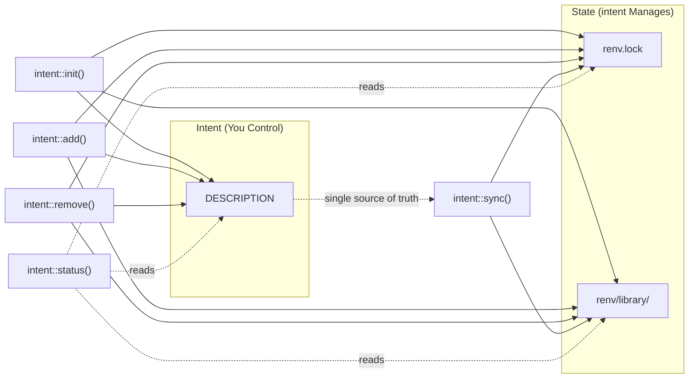

# intent: Fast, Unified Project Management for R

<!-- badges: start -->
[](https://lifecycle.r-lib.org/articles/stages.html#experimental)
[](https://github.com/SInginc/intent/actions/workflows/R-CMD-check.yaml)
<!-- badges: end -->

**`intent`** is a productivity-focused R package manager inspired by Python's `uv`. It provides a single interface to manage project dependencies, using the `DESCRIPTION` file as your **intent** (what you want) and `renv.lock` as your **state** (what you have).

## Why use `intent`?

In standard R, keeping your `DESCRIPTION` file, your installed packages, and your `renv.lock` file in sync is a manual, three-step process. **`intent`** automates this complexity:

* **Manifest-driven:** Uses the standard `DESCRIPTION` file as a `pyproject.toml` equivalent.
* **Blazing Fast:** Uses `pak` under the hood for multi-threaded installations.
* **Explicit Isolation:** Forces `renv` into "explicit" mode—no more accidental dependencies from "junk" scripts.
* **Contract Verification:** Checks that `DESCRIPTION`, repository policy,
  `renv.lock`, and the project library agree.
* **Zero-Config:** Automatically handles `.Rprofile` and repository settings.

---

## Quick Comparison

### intent vs Standard R Workflow

| Action | Standard R (Manual) | R (**`intent`**) |
| --- | --- | --- |
| **Initialize** | Create `DESCRIPTION` manually, run `renv::init()`, configure settings | `intent::init()` |
| **Add Dependency** | Edit `DESCRIPTION`, run `install.packages()`, run `renv::snapshot()` | `intent::add("pkg")` |
| **Remove Dependency** | Edit `DESCRIPTION`, run `remove.packages()`, run `renv::snapshot()` | `intent::remove("pkg")` |
| **Sync Environment** | Run `renv::restore()`, manually check consistency | `intent::sync()` |
| **Check Status** | Manually compare DESCRIPTION, lockfile, and library | `intent::status()` |
| **Verify Contract** | Manually inspect repository and lockfile invariants | `intent::verify()` |

### intent vs Python uv

| Action | Python (`uv`) | R (**`intent`**) |
| --- | --- | --- |
| **Initialize** | `uv init` | `intent::init()` |
| **Add Dependency** | `uv add pkg` | `intent::add("pkg")` |
| **Remove Dependency** | `uv remove pkg` | `intent::remove("pkg")` |
| **Sync Environment** | `uv sync` | `intent::sync()` |
| **Check Status** | `uv status` | `intent::status()` |
| **Verify Contract** | `uv lock --check` / CI checks | `intent::verify()` |

---

## Installation

```r
# Install from GitHub (recommended)
pak::pak("SInginc/intent")

# Or using remotes
remotes::install_github("SInginc/intent")
```

### CLI Setup

To use `intent` from the terminal, add the package's `exec` directory to your
`PATH`:

**Linux / macOS:**

```bash
# Add to ~/.bashrc, ~/.zshrc, or equivalent
export PATH="$PATH:$(Rscript -e 'cat(system.file("exec", package="intent"))')"
```

Alternatively, create a symlink to a directory already on your `PATH`:

```bash
ln -s $(Rscript -e 'cat(system.file("exec", package="intent"))')/intent \
  /usr/local/bin/intent
```

**Windows (PowerShell):**

```powershell
$intentDir = Rscript -e 'cat(system.file("exec", package="intent"))'
[Environment]::SetEnvironmentVariable("PATH", "$env:PATH;$intentDir", "User")
```

After setup, verify with:

```bash
intent --help
```

---

## Usage Example

### Terminal (CLI)

```bash
# Initialize a new project
intent init my_project
intent init my_project --yes
intent init my_project --repo INTERNAL=https://r.example.com/packages/latest

# Add dependencies
intent add dplyr
intent add ggplot2
intent add testthat --dev

# Check what's out of sync
intent status

# Preview changes before applying them
intent sync --dry-run

# Sync environment
intent sync

# Remove a dependency
intent remove ggplot2
```

### R API

```r
# Same commands, same behavior
intent::init("my_project")
intent::add("dplyr")
intent::add("ggplot2")
intent::add("testthat", dev = TRUE)
intent::status()
intent::sync(dry_run = TRUE)
intent::sync()
intent::remove("ggplot2")
```

### Workflow Diagram



---

## Key Functions

### `intent::init(path, repos, install_self = "hydrate")`

Initializes a new or existing directory as an `intent` project.

* Creates a `DESCRIPTION` file if it doesn't exist.
* Initializes a "bare" `renv` environment.
* Sets `renv` to **explicit mode** (only tracks packages in `DESCRIPTION`).
* Configures `.Rprofile` and `.Renviron` for automatic environment loading.
* **Defaults to [Posit Package Manager](https://packagemanager.posit.co/cran/latest)**
  when no repositories are specified. The default repository is named `RSPM`
  to match `renv.lock` provenance. Use `repos = c(NAME = "...")` to override.
* In interactive sessions, confirms the default repository before writing it.
  In non-interactive sessions, writes the default and prints how to declare
  project repositories explicitly.
* **Self-hydrates by default:** copies the currently installed `intent` package
  from your active library paths into the project library when possible, without
  assuming a remote source such as GitHub, CRAN, or R-universe.
* Use `install_self = "never"` if you want `intent` to remain an external tool.

### `intent::add(pkgs, dev = FALSE, dry_run = FALSE)`

The primary way to grow your project.

* **Manifest Update:** Adds the specified package(s) to the `Imports` section of your `DESCRIPTION` (or `Suggests` when `dev = TRUE`).
* **Fast Install:** Uses `pak` to resolve and install the packages into your local project library.
* **Locking:** Updates `renv.lock` through a policy-aware candidate lockfile,
  so strict source policy can reject invalid provenance before replacing the
  official lockfile.
* **Dry Run:** Use `dry_run = TRUE` to preview planned actions without changing files.

### `intent::remove(pkgs, dry_run = FALSE)`

The clean-up tool.

* Removes the package from the `DESCRIPTION` file.
* Uninstalls the package from the local library.
* Updates the `renv.lock` file through the same source-policy checks and prunes
  orphan dependencies.
* **Dry Run:** Use `dry_run = TRUE` to preview without changing files.

### `intent::sync(dry_run = FALSE, prune = TRUE)`

Syncs `renv.lock` to match the `DESCRIPTION` file, then restores the local library.

* Installs packages declared in `DESCRIPTION` but missing from the lockfile.
* **Prune:** Removes packages from the lockfile that are no longer declared (on by default; disable with `prune = FALSE`).
* **Source Policy:** Validates requested sources and candidate lockfiles before
  replacing `renv.lock` in strict mode.
* **Dry Run:** Use `dry_run = TRUE` to preview planned actions.
* Ideal for use after editing `DESCRIPTION` or after `git pull`.

### `intent::status()`

Reports drift between manifest, lockfile, and library **without changing anything**.

* Lists packages declared but not locked.
* Lists packages locked but not declared.
* Lists packages locked but not installed in the local library.
* Reports source policy violations, such as repository packages resolved from a
  repository name not declared in `Config/intent/repos/`.
* Returns a structured object with `print()` and JSON (`as.character()`) output.
* CLI: use `intent status --json` for machine-readable output.

### `intent::verify()` / `intent::doctor()`

Verifies the project contract **without changing anything**.

* Checks that packages declared in `DESCRIPTION` are present in `renv.lock`.
* Checks that locked packages are installed in the project library.
* Checks that `renv.lock` repositories match `Config/intent/repos/`.
* Checks source policy violations and lockfile packages outside the dependency
  closure.
* Returns an `intent_verification` object with `ok`, `issues`, and the
  underlying `intent_status`.
* CLI: use `intent verify --json` for CI-friendly machine-readable output.

---

## Dependency Overrides

When you need a specific version of a package from a non-standard source, or
when the default CRAN version does not work for your project, use
**dependency overrides**. These are written as `Config/intent/` fields in your
`DESCRIPTION` file.

### Format

```dcf
Config/intent/Imports/<pkg>: <package-spec>@<version>@<source>
Config/intent/Suggests/<pkg>: <package-spec>@<version>@<source>
```

Each override must have exactly three non-empty fields separated by `@`.

### Supported Sources

| Source | Package Spec | Example | Description |
|--------|-------------|---------|-------------|
| `cran` | Bare name | `dplyr@1.1.4@cran` | Install a specific version from CRAN. |
| `standard` | Bare name | `dplyr@1.1.4@standard` | Same as `cran`. |
| `github` | `user/repo` | `tidyverse/dplyr@1.1.4@github` | Install a specific version from GitHub. |
| `bioc` | Bare name | `Biobase@3.18@bioc` | Install a specific version from Bioconductor. |
| `local` | Bare name | `mypkg@0.1.0@local` | Install from a local source package. |
| `url` | Bare name | `mypkg@0.1.0@url` | Install from a URL. |
| `https://...` | Bare name | `dplyr@1.1.4@https://example.com/cran` | Install from a custom CRAN-like repository. |

### Example

```dcf
Package: myproject
Imports:
    dplyr
Config/intent/Imports/dplyr: dplyr@1.1.4@cran
Config/intent/Imports/mypkg: myorg/mypkg@0.1.0@github
```

### Common Errors

| Error | Cause | Fix |
|-------|-------|-----|
| `Invalid override format: ... Expected package@version@source` | Missing or extra `@` separators, or an empty field. | Ensure exactly three non-empty parts separated by `@`. |
| `Invalid override source: ... Supported sources are cran, standard, github, bioc, local, url, or an http(s) repository URL` | Unknown source type. | Use one of the supported source values from the table above. |

---

## Repository & Source Policy

`intent` treats `DESCRIPTION` as the project policy file. Repository
configuration and source policy live under `Config/intent/`, so they are
reviewable in code review and portable across machines.

### Repositories

Repositories are declared as named fields:

```dcf
Config/intent/repos/RSPM: https://packagemanager.posit.co/cran/latest
Config/intent/repos/INTERNAL: https://r.example.com/packages/latest
```

When no repository is declared, `intent::init()` proposes Posit Package Manager
as:

```dcf
Config/intent/repos/RSPM: https://packagemanager.posit.co/cran/latest
```

The repository name matters, but intent uses URL-aware matching to avoid
spurious policy violations. If `renv.lock` records `Repository: RSPM` and a
declared repository points to the same Posit Package Manager URL — even under a
different name such as `CRAN` — the match succeeds. Lockfile repository names
that are not declared are supplemented into `$R$Repositories` at snapshot time
so `renv::restore()` can resolve them.

### Source Policy

Source policy controls which kinds of package sources are allowed:

```dcf
Config/intent/source-policy/mode: warn
Config/intent/source-policy/allow/repository: true
Config/intent/source-policy/allow/github: true
Config/intent/source-policy/allow/bioc: true
Config/intent/source-policy/allow/url: true
Config/intent/source-policy/allow/local: true
Config/intent/source-policy/allow/unknown: false
```

`mode` can be:

| Mode | Behavior |
|------|----------|
| `off` | Do not check package source provenance. |
| `warn` | Report source policy violations and continue. This is the default. |
| `error` | Fail mutating commands before replacing the official `renv.lock`. |

Source classes:

| Source | Meaning |
|--------|---------|
| `repository` | CRAN-like repositories, including CRAN, PPM, R-universe, and self-hosted repositories. |
| `github` | GitHub package references. |
| `bioc` | Bioconductor package references. |
| `url` | Direct URL package references. |
| `local` | Local package paths. |
| `unknown` | Lockfile records without enough source metadata. |

`intent`, `renv`, and `pak` are tool packages and are exempt from source policy
violations.

### Strict Mode

Projects that require tighter reproducibility can opt into strict policy:

```dcf
Config/intent/source-policy/mode: error
Config/intent/source-policy/allow/repository: true
Config/intent/source-policy/allow/github: false
Config/intent/source-policy/allow/bioc: false
Config/intent/source-policy/allow/url: false
Config/intent/source-policy/allow/local: false
Config/intent/source-policy/allow/unknown: false
```

In `error` mode, `intent::add()` and `intent::sync()` validate requested sources
before installation when possible, then write a candidate lockfile and validate
it before replacing the official `renv.lock`.

Dependency overrides are checked against the same policy. For example, a GitHub
override requires `Config/intent/source-policy/allow/github: true` unless policy
checking is turned off.

---

## Error Handling

| Scenario | Error Message | Solution |
| --- | --- | --- |
| No `DESCRIPTION` file | `"No DESCRIPTION file found. Run intent::init() first."` | Run `intent::init()` to initialize the project |
| No packages specified | `"No packages specified."` | Provide package names to `intent::add()` or `intent::remove()` |
| Missing `renv` or `pak` | `"The following required packages are missing: ..."` | Install `renv` and `pak` first |
| No repositories configured and defaults disabled | `"No repositories configured. Pass repos = ..."` | Pass `repos = c(NAME = "URL")`, use `intent init --repo NAME=URL`, or add `Config/intent/repos/` fields |
| Source policy violation | `"Source policy violation..."` | Update `Config/intent/source-policy/*`, use an allowed package source, or declare the repository under `Config/intent/repos/` |

---

## .gitignore Recommendations

**Commit these files** (shared across team):
* `DESCRIPTION` — your project's intent (dependencies)
* `renv.lock` — exact versions for reproducibility
* `.Rprofile` — ensures `renv` activates on startup
* `renv/settings.json` — renv configuration
* `renv/activate.R` — renv bootstrap script

**Ignore these** (machine-specific):

```gitignore
# Local library (regenerated by intent::sync)
renv/library/

# renv staging/sandbox
renv/staging/
renv/sandbox/

# User-specific files
.Renviron
*.Rproj.user
```

---

## Migrating from Existing renv Projects

If you have an existing `renv` project:

```r
# 1. Ensure your DESCRIPTION lists all intended dependencies
#    (Check Imports and Suggests sections)

# 2. Set renv to explicit mode
renv::settings$snapshot.type("explicit")

# 3. Enable pak for faster installs
#    Add to .Renviron: RENV_CONFIG_PAK_ENABLED=TRUE

# 4. Sync to ensure consistency
intent::sync()
```

> **Note:** After migration, use `intent::add()` and `intent::remove()` instead of manually editing `DESCRIPTION`.

---

## The `intent` Philosophy: "Intent vs. State"

`intent` enforces a strict separation between what you *intend* to use and the *state* of your machine:

1. **Intent (`DESCRIPTION`):** You edit this (or use `intent::add()`). It lists top-level packages and version constraints.
2. **State (`renv.lock`):** `intent` manages this. It is a machine-readable JSON containing the exact version and hash of every nested dependency.

> **Note:** By using `intent`, you never have to worry about `renv` scanning your entire folder for `library()` calls. If it's not in the `DESCRIPTION`, it's not in the project.

---

## Specifications

To build **`intent`** as a robust orchestrator, the specifications must clearly define how each function interacts with the three underlying pillars: the **Manifest** (`DESCRIPTION`), the **Environment** (`renv`), and the **Engine** (`pak`).

Below are the technical specifications for the core API.

---

## 1. `intent::init()`

**Objective:** Transform a directory into a managed `intent` workspace.

**Arguments:**

* `path`: Directory path (defaults to current).
* `repos`: Character vector of CRAN-like repositories. Defaults to
  `c(RSPM = "https://packagemanager.posit.co/cran/latest")`.
* `install_self`: `"hydrate"` copies the currently installed `intent` package
  into the project library when possible. `"never"` leaves `intent` external.
* `confirm_repos`: Ask before writing the default repository in interactive
  sessions.

**Logical Flow:**

1. **Infrastructure:** Create `DESCRIPTION` if missing.
2. **Repository Default:** If no `repos` are provided and none exist in an
   existing DESCRIPTION, default to Posit Package Manager.
3. **State Init:** Call `renv::init(bare = TRUE)`. This creates the `renv/` folder and `renv.lock` without scanning files.
4. **Policy Setting:** Set `renv::settings$snapshot.type("explicit")`. This is non-negotiable for the `intent` workflow.
5. **Bootstrapping:** Write `source("renv/activate.R")` to `.Rprofile`.
6. **Tool Hydration:** If `install_self = "hydrate"`, copy the already-installed
   `intent` package from the current library paths into the project library when
   available, then snapshot it.
7. **Engine Config:** Set `RENV_CONFIG_PAK_ENABLED=TRUE` in `.Renviron` to enable `pak` as the installation engine.

**Exit State:**

A project ready for `intent::add()`. If self-hydration succeeds,
`library(intent)` works after restarting inside the project. If it does not,
the project is still initialized and `intent` can be installed from the user's
chosen package source.

---

## 2. `intent::add()`

**Objective:** The "uv add" equivalent. Declare, install, and lock a dependency.

* **Arguments:**
  * `pkgs`: Character vector of package names (supports `user/repo` for GitHub).
  * `dev`: Defaults to `FALSE`. If `FALSE`, adds packages to `"Imports"` section. If `TRUE`, adds packages to `"Suggests"` section.
  * `dry_run`: Defaults to `FALSE`. If `TRUE`, returns a plan without installing or writing files.

* **Logical Flow:**

1. **Validation:** Check if `pkgs` are valid strings.
2. **Source Preflight:** Check requested package references and dependency
   overrides against source policy.
3. **Manifest Update:** Use the `desc` package to append packages to the `DESCRIPTION` file.
4. **Installation:** Install packages through the backend with `pak`.

5. **Locking:** Snapshot to a candidate lockfile, validate source provenance,
   then replace the official `renv.lock` only if policy allows it.

* **Exit State:** Package is in `DESCRIPTION`, installed in `renv/library`, and recorded in `renv.lock`.

---

## 3. `intent::remove()`

**Objective:** Reverse the `add` process cleanly.

* **Arguments:**
  * `pkgs`: Character vector of package names to remove.
  * `dry_run`: Defaults to `FALSE`. If `TRUE`, returns a plan without removing files.

* **Logical Flow:**

1. **Manifest Update:** Remove packages from `DESCRIPTION` using `desc::desc_del_dep()`.
2. **Cleanup:** Call `renv::remove(pkgs)`. This deletes the files from the project-local library.
3. **Locking:** Snapshot to a candidate lockfile, validate source provenance,
   then replace the official `renv.lock` only if policy allows it.

* **Exit State:** Package and its orphans are removed from the disk and the lockfile.

---

## 4. `intent::sync()`

**Objective:** Ensure the local library perfectly matches the `DESCRIPTION` file.

* **Arguments:**
  * `dry_run`: Defaults to `FALSE`. If `TRUE`, returns a plan without changing files.
  * `prune`: Defaults to `TRUE`. If `TRUE`, removes packages from the lockfile
    that are no longer declared in `DESCRIPTION`.

* **Logical Flow:**

1. **Comparison:** Compare `DESCRIPTION` against the current contents of `renv.lock`:
    * What packages are in `DESCRIPTION` but not in `renv.lock`?
    * What packages are in `renv.lock` but not in `DESCRIPTION`?
2. Preflight requested sources and overrides against source policy.
3. Install missing dependencies.
4. Remove true orphan dependencies (when `prune = TRUE`), preserving transitive
   dependencies reachable from declared packages.
5. Snapshot to a candidate lockfile and validate source provenance.
6. Restore the library from the updated lockfile.

* **Exit State:** The local environment is a perfect binary mirror of the `renv.lock` file.

---

## 5. `intent::status()`

**Objective:** Report drift without mutating state.

* **Arguments:**
  * `project`: Path to the project directory. Defaults to the current intent project.

* **Logical Flow:**

1. Read declared packages from `DESCRIPTION`.
2. Read locked packages from `renv.lock`.
3. Read installed packages from the project library.
4. Read repository and source policy from `Config/intent/`.
5. Report differences between the three sources of truth.
6. Report source policy violations.

* **Exit State:** No files or packages are changed. Returns an `intent_status`
  object. Use `as.character(status())` or `intent status --json` for
  machine-readable output.

---

## 6. `intent::verify()`

**Objective:** Verify that the project contract is internally consistent.

* **Arguments:**
  * `project`: Path to the project directory. Defaults to the current intent project.

* **Logical Flow:**

1. Read status from `DESCRIPTION`, `renv.lock`, and the project library.
2. Check that declared dependencies are locked.
3. Check that locked packages are installed.
4. Check that lockfile repositories match `Config/intent/repos/`.
5. Check source policy violations.
6. Check for lockfile packages outside the dependency closure rooted at
   `DESCRIPTION` dependencies and bootstrap packages.

* **Exit State:** No files or packages are changed. Returns an
  `intent_verification` object. Use `as.character(verify())` or
  `intent verify --json` for machine-readable output. The CLI exits with an
  error when verification fails.

---

## Summary of Interaction Logic

| Function | Primary Tool | Target File | Impact |
| --- | --- | --- | --- |
| `init` | `renv` | `.Rprofile` | Environment Architecture |
| `add` | `desc` + `pak` | `DESCRIPTION` | Manifest & Library |
| `remove` | `desc` + `renv` | `DESCRIPTION` | Manifest & Library |
| `sync` | `renv` + `pak` | `renv.lock` | Library State |
| `status` | `desc` + `renv` | (read-only) | Drift Inspection |
| `verify` | `desc` + `renv` | (read-only) | Contract Verification |

---
